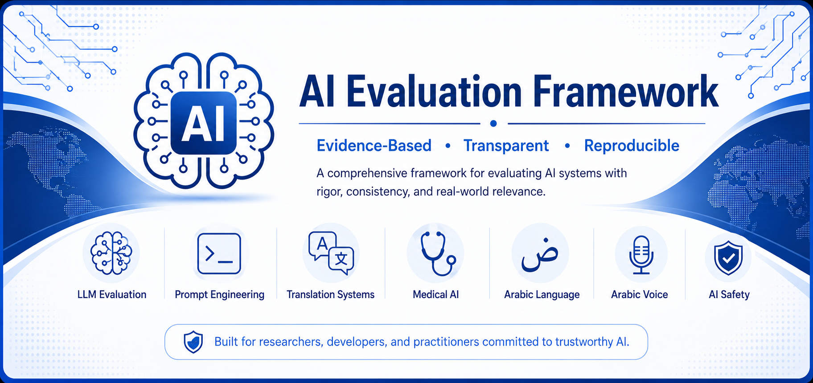

<p align="center">
  
</p>

<h1 align="center">AI Evaluation Framework</h1>


A structured, evidence-based framework for evaluating Large Language Models (LLMs), prompt engineering, translation systems, medical AI, Arabic language, Arabic voice, and AI safety.

## Table of Contents

- [Overview](#overview)
- [Key Features](#key-features)
- [Quick Start](#quick-start)
- [Validation Results](#validation-results)
- [Repository Structure](#repository-structure)
- [Supported Evaluation Domains](#supported-evaluation-domains)
- [Framework Components](#framework-components)
- [Evaluation Workflow](#evaluation-workflow)
- [Key Principles](#key-principles)
- [License](#license)

## Overview

The AI Evaluation Framework is an evidence-based methodology for evaluating AI systems across multiple domains using standardized rubrics, transparent scoring, and reproducible evaluation reports.

## Key Features

- 📊 Evidence-based AI evaluation methodology
- 📋 Standardized scoring and reporting
- 🌍 Support for seven evaluation domains
- 🧩 Domain-specific evaluation rubrics
- 📄 Reproducible evaluation report templates
- 🔍 Transparent scoring with clear justifications
- ⚖️ Focus on quality, safety, and reliability

## Quick Start

1. Explore the evaluation methodology in the `methodology/` folder.
2. Review the domain-specific rubrics in the `rubrics/` folder.
3. Use the evaluation report template in the `templates/` folder.
4. Explore example evaluations in the `examples/` folder.
5. Review completed evaluations in the `sample-reports/` folder.

## Validation Results

The framework has been validated across all supported evaluation domains using representative test cases.

| Domain | Status |
|--------|--------|
| Large Language Model (LLM) Evaluation | ✅ Validated |
| Prompt Engineering Evaluation | ✅ Validated |
| Translation Evaluation | ✅ Validated |
| Medical AI Evaluation | ✅ Validated |
| Arabic Language Evaluation | ✅ Validated |
| Arabic Voice Evaluation | ✅ Validated |
| AI Safety Evaluation | ✅ Validated |

The validation confirmed consistent rubric selection, transparent scoring, evidence-based reasoning, and standardized reporting across all supported domains.

## Repository Structure

```
AI-Evaluation-Framework/
├── methodology/
├── rubrics/
├── templates/
├── examples/
├── sample-reports/
├── README.md
└── LICENSE
```

## Supported Evaluation Domains

- Large Language Model (LLM) Evaluation
- Prompt Engineering Evaluation
- Translation Evaluation
- Medical AI Evaluation
- Arabic Language Evaluation
- Arabic Voice Evaluation
- AI Safety Evaluation

## Framework Components

- Standardized evaluation methodology
- Domain-specific evaluation rubrics
- Five-point scoring system
- Reusable report templates
- Evidence-based justification
- Sample evaluation reports

## Evaluation Workflow

1. Identify the project type.
2. Select the appropriate evaluation rubric.
3. Choose only the relevant evaluation criteria.
4. Evaluate each criterion independently.
5. Support every score with explicit evidence.
6. Compare strengths and weaknesses.
7. Produce a structured evaluation report.
8. State study limitations and future work.

## Key Principles

- Evidence-based evaluation
- Transparent scoring
- Objective analysis
- Domain-specific assessment
- Reproducible methodology
- Clear documentation

## Validation

The framework has been validated across seven evaluation domains:

- ✅ LLM Evaluation
- ✅ Prompt Engineering Evaluation
- ✅ Translation Evaluation
- ✅ Medical AI Evaluation
- ✅ Arabic Language Evaluation
- ✅ Arabic Voice Evaluation
- ✅ AI Safety Evaluation

## License

MIT License
